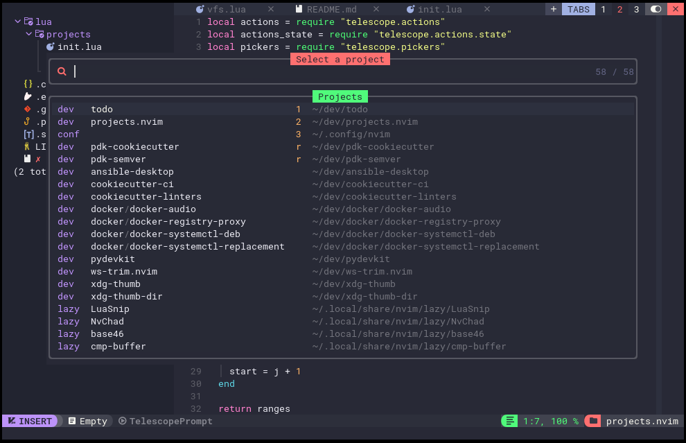
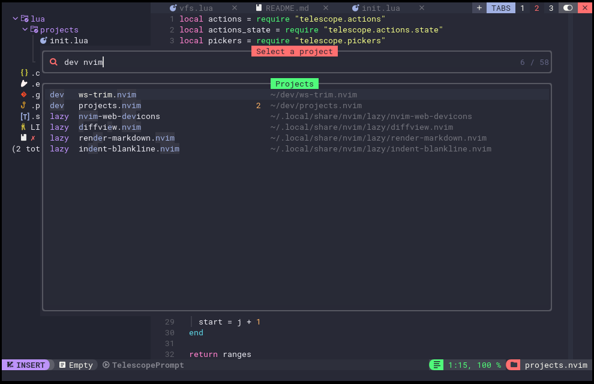

# `telescope-projects.nvim`

[](https://github.com/aanatoly/telescope-projects.nvim/releases)
[](./LICENSE)
[][neovim]


[Neovim][neovim] Telescope plugin to switch between projects.





**Features:**

- Discover projects from predefined workspaces automatically.
- Prioritize open projects and display associated tab numbers.
- Prioritize recent projects and display up to `recent_max - opened` entries.
- Maintain a list of recent projects, up to `recent_max` entries.
- Default action (`<CR>`) opens a project in a dedicated tab and switches to it.

## Installation

Installation with `lazy`

```lua
return {
  "aanatoly/telescope-projects.nvim",
  cmd = { "ProjectList" },
  depends = { "nvim-telescope/telescope.nvim" },
  opts = {
    workspaces = {
      conf = "~/.config/nvim",
      lazy = "~/.local/share/nvim/lazy",
      dev = "~/dev",
      work = "~/work",
    },
  },
}
```

## Configuration

The default configuration is

```lua
opts = {
  -- symbol to mark recent projects
  recent_sign = "r",
  -- max number of recent entries
  recent_max = 5,
  -- workpsaces table with (name = "path") pairs
  workspaces = {},
  -- max depth to search for project within workspaces
  maxdepth = 4,
}
```

## Usage

You can bind it to a key

```lua

vim.keymap.set("n", "<leader>pp", ":ProjectList<CR>", { desc = "List Projects" })
```

or run from command line `:ProjectList`

## Credits

Big thanks to these awesome projects for ideas and inspiration:

- [telescope-project][telescope-project] - An extension for telescope.nvim that allows you to switch between projects by [Telescope Team][telescope-team]

[neovim]: https://neovim.io/
[telescope-project]: https://github.com/nvim-telescope/telescope-project.nvim
[telescope-team]: https://github.com/nvim-telescope
